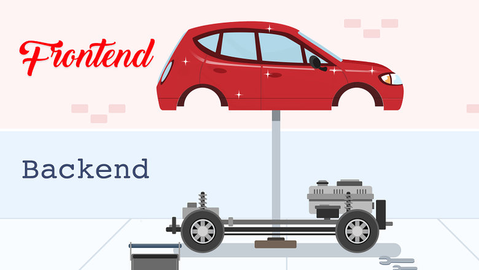

# Awesome Project 🚀

# Awesome DRF Project

Добро пожаловать в самый крутой и мощный проект на Django REST Framework! 🚀

Этот проект представляет собой полноценный API для управления пользователями, соревнованиями, командами, заявками и многим другим. Он идеально подходит для спортивных или киберспортивных платформ, где важна регистрация, управление участниками, организация соревнований и взаимодействие между пользователями.

---

## 🚀 Возможности проекта

### Аутентификация и управление пользователями
- Регистрация новых пользователей
- Вход в систему (логин)
- Просмотр и редактирование профиля пользователя
- Одобрение и отклонение регистрации пользователей (модерация)

### Управление соревнованиями
- Создание и список соревнований
- Просмотр истории участий
- Управление статусами и решениями по соревнованиям (одобрение/отклонение)
- Выгрузка данных участников и результатов в структурированном виде
- Просмотр соревнований по региону и организованных пользователем

### Команды
- Создание команд
- Просмотр публичных команд
- Управление командами пользователя

### Вакансии и отклики
- Просмотр и управление откликами на вакансии капитана
- Отправка откликов на публичные вакансии
- Принятие или отклонение откликов

### Приглашения и заявки
- Создание и управление приглашениями
- Ответы на приглашения
- Создание и обработка заявок команд и пользователей
- Отдельный интерфейс для организаторов для работы с заявками

### Справочники
- Часто задаваемые вопросы (FAQ)
- Новости
- Роли пользователей
- Регионы
- Дисциплины
- Региональные представители

---

## 📚 API Endpoints

### Аутентификация
| Метод | URL                     | Описание                        |
|-------|-------------------------|--------------------------------|
| POST  | `/api/auth/register/`   | Регистрация нового пользователя|
| POST  | `/api/auth/login/`      | Вход в систему                 |

### Пользователи
| Метод | URL                     | Описание                        |
|-------|-------------------------|--------------------------------|
| GET   | `/users/`               | Список всех пользователей       |
| GET/PUT/PATCH/DELETE | `/user-profile/` | CRUD операции с профилем пользователя |
| POST  | `/approvals/`           | Одобрение/отклонение регистрации |

### Соревнования
| Метод | URL                                      | Описание                                   |
|-------|------------------------------------------|--------------------------------------------|
| GET   | `/competitions/`                         | Список всех соревнований                    |
| POST  | `/competitions/create/`                  | Создание соревнования                       |
| GET   | `/competitions/history/`                 | История участий                             |
| GET   | `/competitions/organized/`               | Соревнования, организованные пользователем |
| GET   | `/competitions/pending/`                 | Соревнования на модерации                   |
| POST  | `/competitions/decision/`                | Решение по соревнованию (одобрить/отклонить)|
| POST  | `/competitions/distribute-results/`     | Распределение результатов                   |
| GET   | `/competitions/<int:competition_id>/participants/` | Участники конкретного соревнования         |
| PATCH | `/competitions/status/`                  | Обновление статусов соревнований            |
| GET   | `/competitions/region/<int:region_id>/` | Соревнования по региону                      |
| GET   | `/competitions/download/`                | Выгрузка соревнований и результатов в файл |

### Команды
| Метод | URL                     | Описание                        |
|-------|-------------------------|--------------------------------|
| POST  | `/teams/`               | Создание команды               |
| GET   | `/teams/public/`        | Публичные команды              |
| GET   | `/user/teams/`          | Команды пользователя           |

### Вакансии и отклики
| Метод | URL                     | Описание                        |
|-------|-------------------------|--------------------------------|
| GET   | `/vacancy-responses/`   | Отклики для капитана            |
| POST  | `/response-to-public/`  | Отправка отклика на публичную вакансию |
| POST  | `/response-action/`     | Действия с откликом (принять/отклонить) |
| GET   | `/user/vacancy-responses/` | Отклики пользователя          |

### Приглашения и заявки
| Метод | URL                                   | Описание                          |
|-------|-------------------------------------|----------------------------------|
| POST  | `/invitations/`                     | Создание приглашения             |
| GET   | `/user/invitations/`                | Приглашения пользователя         |
| POST  | `/invitations/<int:pk>/respond/`   | Ответ на приглашение             |
| POST  | `/team-applications/`               | Создание заявки команды          |
| POST  | `/team-applications/<int:pk>/response/` | Ответ на заявку команды      |
| POST  | `/user-applications/`               | Создание заявки пользователя     |
| POST  | `/user-applications/<int:pk>/response/` | Решение по заявке пользователя |
| GET   | `/organizer/user/applications/`    | Заявки пользователей для организатора |
| GET   | `/organizer/team/applications/`    | Заявки команд для организатора   |

### Справочники
| Метод | URL                     | Описание                        |
|-------|-------------------------|--------------------------------|
| GET   | `/faq/`                 | Часто задаваемые вопросы       |
| GET   | `/news/`                | Новости                       |
| GET   | `/roles/`               | Список ролей                  |
| GET   | `/regions/`             | Список регионов               |
| GET   | `/disciplines/`         | Список дисциплин              |
| GET   | `/regional-representatives/` | Региональные представители |

---

## 🛠 Технологии

- Python 
- Django 
- Django REST Framework
- JWT аутентификация 

---
